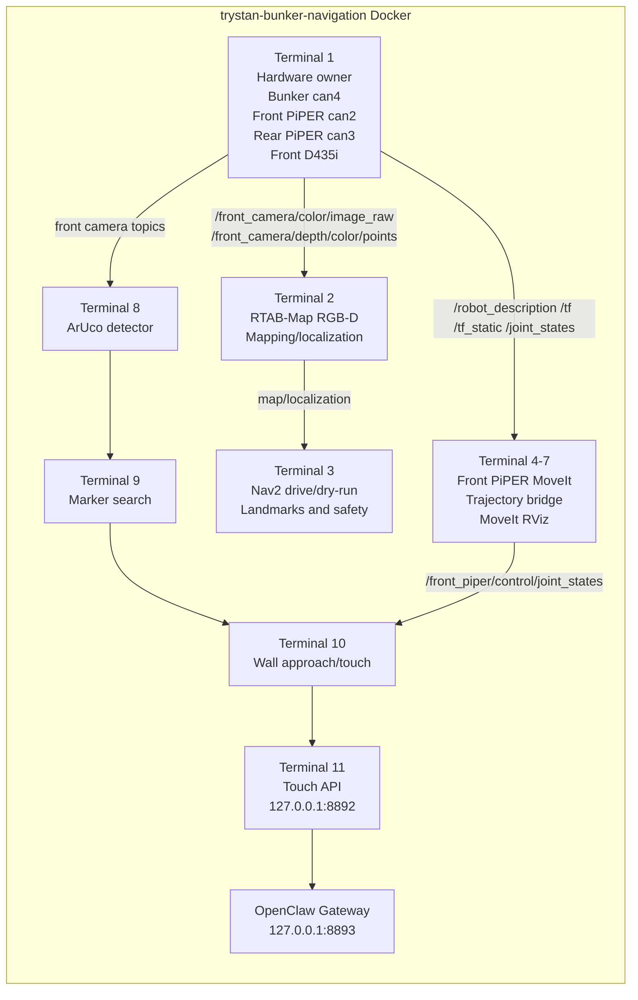

# Bunker PiPER Integration

[](https://github.com/notalexander30/bunker-piper_integration/actions/workflows/ci.yml)

ROS 2 Humble workspace packages for the Bunker mobile base, dual AgileX PiPER arms, front Intel RealSense D435i, RTAB-Map/Nav2 navigation, and the front PiPER-X ArUco wall-touch manipulation flow.

The maintained operator runbook is:

- [Nav-Man integration startup](bunker_slam_bringup/NAV_MAN_INTEGRATION_STARTUP.md)

## Repository Layout

| Path | Purpose |
|---|---|
| `bunker_slam_bringup/` | Trystan Bunker bringup, robot TF, RealSense, RTAB-Map, Nav2, RViz configs, and the Nav-Man startup runbook. |
| `bunker_dual_piper_nav2/` | Combined Bunker + front/rear PiPER + D435i URDF/xacro package, meshes, dual PiPER launch files, Nav2/RTAB-Map configs, and RViz previews. |
| `bunker_autonomy/` | Navigation helper nodes, safety monitors, landmark navigation, clicked-goal utilities, and optional Nav2-to-manipulation handoff trigger. |
| `piper_x_aruco_wall_approach/` | Front PiPER-X MoveIt/ArUco wall approach, touch services, HTTP API bridge on `127.0.0.1:8892`, and tests. |
| `docker/` | Example Docker image and compose file for a ROS 2 Humble Nav-Man development container. |
| `docs/` | GitHub-facing architecture, CAN discovery, gateway, and visualization notes. |
| `openclaw/` | Supported OpenClaw skill for the localhost PiPER gateway. |

## Current Nav-Man Design



Key rule: only one process owns each hardware driver, camera, robot description, TF tree, odometry source, RTAB-Map instance, Nav2 stack, and API port. The Nav-Man startup keeps Trystan's terminals as the hardware/navigation owner and layers Iliyas' manipulation services on top of those existing topics.

## Hardware Defaults

| Device | Public setup default |
|---|---|
| Front PiPER | Discover first, then pass the resolved `canX`, 1 Mbit/s |
| Rear PiPER | Discover first, then pass the resolved `canX`, 1 Mbit/s |
| Bunker base | Discover first, then pass the resolved `canX`, 500 kbit/s |
| Front D435i | Discover first with `rs-enumerate-devices`, then pass the serial |
| Rear D435i | Disabled in the simplified startup |
| ROS domain | `ROS_DOMAIN_ID=173`, `ROS_LOCALHOST_ONLY=1` |

See [CAN discovery](docs/can_discovery.md) before starting hardware. The current lab robot may use `can2`/`can3`/`can4`, but public users should not assume `canN` order is stable.

## Quick Build

Clone this repository into a ROS 2 workspace src directory, import the pinned
external dependencies, then build the packages:

```bash
cd /ros2_ws
vcs import src < src/bunker-piper_integration/dependencies.repos
rosdep install --from-paths src --ignore-src -r -y \
  --skip-keys "bunker_object_follower semantic_memory"
colcon build --symlink-install \
  --packages-select bunker_slam_bringup bunker_dual_piper_nav2 bunker_autonomy piper_x_aruco_wall_approach
source install/setup.bash
```

See [external dependencies](docs/dependencies.md) for pinned revisions and the
two optional lab-only packages that do not yet have public upstream URLs.

The real robot workflow runs inside the `trystan-bunker-navigation` Docker container. Follow the terminal-by-terminal commands in [NAV_MAN_INTEGRATION_STARTUP.md](bunker_slam_bringup/NAV_MAN_INTEGRATION_STARTUP.md).

For a reproducible development container, see [Docker setup](docker/README.md).

## URDF And RViz Preview

The combined model is in:

- `bunker_dual_piper_nav2/urdf/bunker_dual_piper_d435i.urdf.xacro`
- `bunker_dual_piper_nav2/urdf/bunker_dual_piper_d435i.generated.urdf`
- `bunker_slam_bringup/descriptions/nav_man_full_robot.urdf`

Preview the dual PiPER model without hardware:

```bash
ros2 launch bunker_dual_piper_nav2 system_bringup.launch.py \
  start_hardware_drivers:=false start_cameras:=false start_nav2:=false \
  publish_default_joint_states:=true prefix_joint_states:=false start_rviz:=true
```

See [URDF visualization](docs/urdf_visualization.md) for the frame map and RViz checks.

## Safety Notes

- Do not start standalone PiPER, RealSense, robot-state-publisher, RTAB-Map, or Nav2 launch files while the Nav-Man startup already owns them.
- Physical PiPER movement requires the explicit `allow_piper_motion:=true` argument in the launch path that supports it.
- The supported OpenClaw gateway must remain a client of the lower-level
  8892 API and must never become a second hardware or ROS graph owner.
- Validate CAN adapter labels and front/rear PiPER assignment before commanding motion.
- The lower-level PiPER touch API is documented on `127.0.0.1:8892`; the OpenClaw gateway is documented on `127.0.0.1:8893`. See [OpenClaw gateway](docs/openclaw_gateway.md).

## Public Repository Policy

- The repository is intended to be public.
- Hardware SDKs and ROS wrappers remain external, pinned dependencies.
- Current robot calibration values, camera identifiers, and sample maps are
  included as operator-provided project data.
- The OpenClaw gateway on 127.0.0.1:8893 is a supported component.
- GitHub Actions builds and tests the four maintained packages on ROS 2 Humble.

## Licensing

New repository-level integration material is released under Apache-2.0. Some
package directories and third-party assets retain their existing BSD-3-Clause,
MIT, Apache-2.0, or upstream terms. See [licensing and asset
provenance](docs/licensing.md) before redistributing robot meshes.
