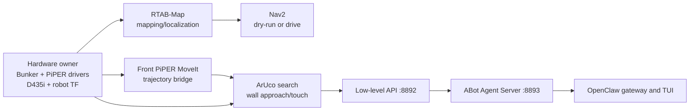

# Bunker Nav-Man

[](https://github.com/notalexander30/bunker-piper_integration/actions/workflows/ci.yml)

ROS 2 Humble integration for an AgileX Bunker mobile base, two AgileX PiPER
arms, an Intel RealSense D435i, RTAB-Map, Nav2, MoveIt 2, and an ArUco-guided
front-arm touch workflow.

The primary launcher is now named `start_nav_man_workflow.py`. The former
`start_iliyas_abot_in_trystan.py` command remains as a compatibility alias for
existing deployments.

## Is the complete workflow included?

The maintained software workflow is included and automated. A fresh clone can
build the four repository packages and their pinned public dependencies. The
repository cannot contain or infer environment-specific hardware facts, so the
real robot still needs the items marked **operator required** below.

| Component | Included? | What is still required? |
|---|---:|---|
| Bunker, dual-PiPER, D435i URDF/TF | Yes | Verify the physical mounts and transforms. |
| Bunker and PiPER ROS drivers | Yes, pinned externally | Connect the hardware and discover its CAN interfaces. |
| RealSense, RTAB-Map, Nav2, MoveIt, ArUco | Yes, installed in Docker | Provide the front-camera serial and validate camera calibration. |
| Navigation and safety configuration | Yes | Validate footprint, clearances, emergency stop, and velocity limits on the actual robot. |
| ArUco search, approach, touch, and HTTP APIs | Yes | Print/use marker ID 6 at 60 mm, then validate in dry-run before allowing arm motion. |
| Landmark example and occupancy-grid examples | Yes | Replace their poses/map with values measured in the deployment area. |
| RTAB-Map localization database | No, environment-specific | Create a map once or copy an existing `.db` into `/ros2_ws/maps`. |
| OpenClaw skill and compatibility gateway | Yes | The preferred Iliyas ABot Agent Server and OpenClaw application are external. |
| Physical end-to-end validation | No | Must be performed by an operator with the robot and an emergency stop. |

In short: the repository is **software-complete for the maintained workflow**,
but it is not **deployment-complete** until the operator supplies a site map,
device identifiers, and physical safety/calibration validation.

## Architecture



Only one process may own a hardware driver, camera, robot description, TF tree,
odometry source, RTAB-Map instance, Nav2 stack, or API port.

## Hardware and host prerequisites

- Ubuntu 22.04 host capable of running Docker with Compose.
- AgileX Bunker base and one or two PiPER arms with supported CAN adapters.
- Front Intel RealSense D435i.
- Working emergency stop and a clear arm workspace.
- X11 access if RViz will run from the container.
- Internet access for the first image build.

The tested software baseline is ROS 2 Humble. Native installation is possible,
but the Docker path below is the maintained setup.

## 1. Clone and build

```bash
git clone https://github.com/notalexander30/bunker-piper_integration.git
cd bunker-piper_integration
docker compose -f docker/compose.yaml build bunker-nav-man
```

The image imports the exact revisions in [`dependencies.repos`](dependencies.repos)
and installs the remaining ROS dependencies. See
[`docs/dependencies.md`](docs/dependencies.md) for the dependency policy.

For the optional Iliyas ABot Agent Server and OpenClaw layer, see
[`docs/iliyas_openclaw_integration.md`](docs/iliyas_openclaw_integration.md).

## 2. Start the container

On the host, allow RViz to use the X display and start the named container:

```bash
export DISPLAY=${DISPLAY:-:1}
xhost +SI:localuser:root
docker compose -f docker/compose.yaml up -d bunker-nav-man
docker exec -it bunker-nav-man bash
```

Inside the container:

```bash
cd /ros2_ws
source /opt/ros/humble/setup.bash
source install/setup.bash
export ROS_DOMAIN_ID=173
export ROS_LOCALHOST_ONLY=1
export RMW_IMPLEMENTATION=rmw_fastrtps_cpp
```

## 3. Discover the robot devices

Never assume Linux will preserve a particular `canN` assignment.

```bash
ip -br link show type can
for interface in /sys/class/net/can*; do
  [ -e "$interface" ] && udevadm info -q property -p "$interface" | \
    grep -E 'ID_SERIAL=|ID_PATH='
done
rs-enumerate-devices -s
```

Set these deployment values using the interfaces and serial discovered above:

```text
export BUNKER_CAN=                 # discovered Bunker interface, 500 kbit/s
export FRONT_PIPER_CAN=            # discovered front PiPER interface, 1 Mbit/s
export REAR_PIPER_CAN=             # discovered rear PiPER interface, optional
export FRONT_CAMERA_SERIAL=        # discovered D435i serial
```

Use [`docs/can_discovery.md`](docs/can_discovery.md) to map stable USB adapter
identities to CAN roles before enabling motors.

## 4. Create or provide a navigation map

RTAB-Map databases are site-specific and ignored by Git. The Compose volume
persists `/ros2_ws/maps` across container restarts.

To create a new database, start in mapping mode with arm motion disabled:

```bash
ros2 run bunker_slam_bringup start_nav_man_workflow.py --replace \
  --mapping-mode mapping --reset-database \
  --database-path /ros2_ws/maps/site.db \
  --bunker-can "$BUNKER_CAN" \
  --front-piper-can "$FRONT_PIPER_CAN" \
  --rear-piper-can "$REAR_PIPER_CAN" \
  --front-camera-serial "$FRONT_CAMERA_SERIAL"
tmux attach -t 0
```

Drive slowly while mapping from another sourced container shell:

```bash
ros2 run teleop_twist_keyboard teleop_twist_keyboard \
  --ros-args -r cmd_vel:=/cmd_vel
```

Keep the emergency stop in reach and verify the command route before pressing a
motion key. If an existing database is available, copy it to the persistent
`/ros2_ws/maps` volume instead.

## 5. Safe complete-workflow startup

Start localization and all Nav-Man panes without physical PiPER commands:

```bash
ros2 run bunker_slam_bringup start_nav_man_workflow.py --replace \
  --mapping-mode localization \
  --database-path /ros2_ws/maps/site.db \
  --bunker-can "$BUNKER_CAN" \
  --front-piper-can "$FRONT_PIPER_CAN" \
  --rear-piper-can "$REAR_PIPER_CAN" \
  --front-camera-serial "$FRONT_CAMERA_SERIAL"
tmux attach -t 0
```

The launcher creates panes for hardware, RTAB-Map, Nav2 dry-run, front-arm
MoveIt, trajectory bridging, RViz, ArUco, search/touch services, local APIs,
watchdogs, and optional frontier exploration. Nav2 begins in dry-run and arm
execution is denied by default.

If the rear arm is unavailable, append:

```text
--disable-rear-piper
```

## 6. Validate before allowing motion

Confirm at minimum:

```bash
ros2 topic hz /odom
ros2 topic hz /front_camera/color/image_raw
ros2 topic hz /front_camera/depth/color/points
ros2 topic echo --once /joint_states
ros2 run tf2_ros tf2_echo map base_link
ros2 action list | grep follow_joint_trajectory
curl -fsS http://127.0.0.1:8892/health
curl -fsS http://127.0.0.1:8893/health
```

Also confirm that the front/rear joint prefixes match the physical arms, the
robot footprint is `1.15 m x 0.60 m`, obstacles stop the chassis, the front
camera optical frame points forward, and the PiPER planned path is collision
free.

Only after dry-run validation, restart with the explicit arm-motion gate:

```text
--allow-piper-motion
```

Nav2 chassis drive mode is also a separate deliberate step. Follow the staged
checks and drive-mode command in the full operator runbook:
[`bunker_slam_bringup/NAV_MAN_INTEGRATION_STARTUP.md`](bunker_slam_bringup/NAV_MAN_INTEGRATION_STARTUP.md).

## Repository packages

| Package | Purpose |
|---|---|
| `bunker_slam_bringup` | Hardware/TF ownership, RTAB-Map, Nav2, RViz, watchdogs, and workflow launcher. |
| `bunker_dual_piper_nav2` | Combined Bunker, dual-PiPER, and D435i URDF/xacro and visualization. |
| `bunker_autonomy` | Navigation helpers, safety monitors, landmark navigation, and optional autonomy nodes. |
| `piper_x_aruco_wall_approach` | Front-arm MoveIt/ArUco search, approach, touch, and local HTTP gateways. |

## URDF preview without hardware

```bash
ros2 launch bunker_dual_piper_nav2 system_bringup.launch.py \
  start_hardware_drivers:=false start_cameras:=false start_nav2:=false \
  publish_default_joint_states:=true prefix_joint_states:=false start_rviz:=true
```

See [`docs/urdf_visualization.md`](docs/urdf_visualization.md) for the frame tree
and RViz checks.

## Build and test without Docker

```bash
mkdir -p ~/nav_man_ws/src
cd ~/nav_man_ws/src
git clone https://github.com/notalexander30/bunker-piper_integration.git
cd ..
vcs import src < src/bunker-piper_integration/dependencies.repos
rosdep install --from-paths src --ignore-src -r -y \
  --skip-keys "bunker_object_follower semantic_memory"
colcon build --symlink-install --packages-up-to \
  bunker_slam_bringup bunker_dual_piper_nav2 bunker_autonomy \
  piper_x_aruco_wall_approach
source install/setup.bash
colcon test --return-code-on-test-failure --packages-select \
  bunker_slam_bringup bunker_dual_piper_nav2 bunker_autonomy \
  piper_x_aruco_wall_approach
colcon test-result --verbose
```

`bunker_object_follower` and `semantic_memory` are optional lab demos and are
not required by the maintained complete workflow.

## Licensing

New repository-level integration material is Apache-2.0. Package directories
and third-party assets retain their existing licenses or upstream terms. See
[`docs/licensing.md`](docs/licensing.md).
