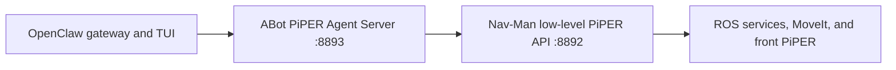

# Iliyas ABot/OpenClaw integration

This optional layer follows the supplied live tmux reference while keeping all
machine-specific CAN interfaces and camera serials out of the repository.

## Ownership and ports



- This repository owns the ROS manipulation nodes and the low-level API on
  `127.0.0.1:8892`.
- The external ABot checkout optionally owns the Iliyas Agent Server on
  `127.0.0.1:8893`.
- OpenClaw calls 8893. It must not start another 8892 API, hardware driver,
  camera, TF publisher, MoveIt stack, RTAB-Map instance, or Nav2 stack.
- Never run the external Agent Server and the bundled 8893 compatibility
  gateway simultaneously.

## Install the optional external checkout

Keep it outside `/ros2_ws/src` because it contains a mirror of the
`piper_x_aruco_wall_approach` package already maintained here.

```bash
mkdir -p /opt/nav-man-agent
vcs import /opt/nav-man-agent < \
  /ros2_ws/src/bunker-piper_integration/optional_agent_dependencies.repos
```

The external repository has its own provenance and redistribution terms and no
license file was present in the pinned revision when checked. It is not copied
into this repository; obtain the owner's permission before redistributing it.

## Start with the Nav-Man launcher

Pass the external checkout and deployment-specific device values:

```bash
ros2 run bunker_slam_bringup start_nav_man_workflow.py --replace \
  --abot-root /opt/nav-man-agent/ABot-Claw-piperX \
  --database-path /ros2_ws/maps/site.db \
  --bunker-can "$BUNKER_CAN" \
  --front-piper-can "$FRONT_PIPER_CAN" \
  --rear-piper-can "$REAR_PIPER_CAN" \
  --front-camera-serial "$FRONT_CAMERA_SERIAL"
```

Without `--abot-root`, pane `t12_agent_8893` runs the bundled compatibility
gateway instead. Both choices call the same low-level 8892 API.

The Iliyas reference parameters incorporated by the launcher are:

- ArUco marker ID 6 and marker size 0.06 m.
- Search input `/joint_states`, MoveIt namespace `front_piper`, and
  `require_physical_hardware:=false` for planning/dry-run compatibility.
- Wall approach point cloud `/front_camera/depth/color/points` and explicit
  joint-state input `/joint_states`.
- Flange contact offset 0.1425 m and final clearance 0.005 m.
- Agent Server joint feedback `/front_piper/feedback/joint_states`, trajectory
  action `/front_piper/arm_controller/follow_joint_trajectory`, and lower API
  `http://127.0.0.1:8892`.

## OpenClaw gateway and TUI

After both health checks succeed, start the gateway and TUI from the external
checkout using its deployment instructions. The supplied live reference uses
`deployment/scripts/start_openclaw_trystan.sh`; confirm that script exists in
the selected ABot revision before invoking it.

```bash
curl -fsS http://127.0.0.1:8892/health | python3 -m json.tool
curl -fsS http://127.0.0.1:8893/health | python3 -m json.tool
```

Physical arm execution remains disabled unless both the low-level API gate and
the Agent Server gate are explicitly enabled. The Nav-Man launcher enables both
only when the operator supplies `--allow-piper-motion`.
