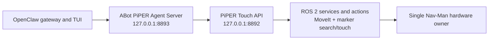

# OpenClaw and PiPER Agent integration

Nav-Man supports the Iliyas ABot/OpenClaw layering from the supplied live tmux
reference:



| Port | Owner | Purpose |
|---|---|---|
| `8892` | This repository | Low-level marker search, approach, touch, saved poses, health, and motion gate. |
| `8893` | Preferred: external Iliyas ABot Agent Server | OpenClaw-facing tools, leases, health, and state. |
| `8893` | Fallback: bundled compatibility gateway | Lightweight `/openclaw/*` proxy when ABot is not installed. |

Only one implementation may bind 8893. Neither implementation may start a
second hardware driver, camera, robot-state publisher, MoveIt stack, RTAB-Map,
Nav2 stack, 8892 API, or TF branch.

## Preferred Iliyas Agent Server

Install the optional checkout outside `/ros2_ws/src`, then pass it to the
workflow launcher. See
[`iliyas_openclaw_integration.md`](iliyas_openclaw_integration.md).

```bash
ros2 run bunker_slam_bringup start_nav_man_workflow.py --replace \
  --abot-root /opt/nav-man-agent/ABot-Claw-piperX \
  --database-path /ros2_ws/maps/site.db \
  --bunker-can "$BUNKER_CAN" \
  --front-piper-can "$FRONT_PIPER_CAN" \
  --rear-piper-can "$REAR_PIPER_CAN" \
  --front-camera-serial "$FRONT_CAMERA_SERIAL"
```

Check both layers:

```bash
curl -fsS http://127.0.0.1:8892/health | python3 -m json.tool
curl -fsS http://127.0.0.1:8893/health | python3 -m json.tool
```

The Agent Server exposes `/tools/*` routes and requires an active lease for
execution. The exact routes are owned by the selected ABot revision.

## Bundled compatibility gateway

When `--abot-root` is omitted, the launcher starts the bundled proxy on 8893:

```bash
ros2 run piper_x_aruco_wall_approach openclaw_gateway.py \
  --host 127.0.0.1 --port 8893 \
  --api-base http://127.0.0.1:8892
```

Its compatibility endpoints are:

```text
GET  /health
GET  /capabilities
POST /openclaw/search_marker
POST /openclaw/approach_marker
POST /openclaw/touch_marker
POST /openclaw/retract
POST /openclaw/stop
```

This fallback is not the lease-aware ABot Agent Server.

## Install the OpenClaw skill

Copy or symlink the repository skill into the OpenClaw workspace:

```bash
mkdir -p /path/to/openclaw-workspace/skills
ln -s /ros2_ws/src/bunker-piper_integration/openclaw/skills/piper-touch-marker \
  /path/to/openclaw-workspace/skills/piper-touch-marker
```

Physical execution requires explicit operator approval and both the 8892 and
8893 execution gates. The launcher keeps them disabled unless
`--allow-piper-motion` is supplied.
