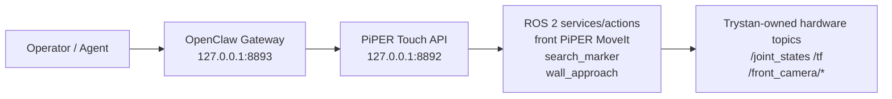

# OpenClaw Gateway

The current Nav-Man integration keeps the direct manipulation API and the higher-level OpenClaw gateway as separate layers:



## Ports

| Port | Layer | Purpose |
|---|---|---|
| `8892` | `piper_touch_marker_api.py` | Lower-level front PiPER marker search, approach, touch, previous pose, health, and motion API. |
| `8893` | OpenClaw gateway | Higher-level gateway for agent/OpenClaw commands that should call `8892` instead of owning ROS hardware directly. |

## Rule

The `8893` gateway must not start a second PiPER driver, RealSense node, robot-state-publisher, MoveIt stack, RTAB-Map instance, Nav2 instance, or TF branch. It should translate high-level OpenClaw requests into validated calls against `8892`.

## Suggested Gateway Contract

Minimum endpoints for the gateway:

```text
GET  /health
GET  /capabilities
POST /openclaw/search_marker
POST /openclaw/approach_marker
POST /openclaw/touch_marker
POST /openclaw/retract
POST /openclaw/stop
```

The gateway should forward to the lower-level API only after checking:

- Nav-Man ROS domain is reachable.
- `8892 /health` is healthy.
- `/front_piper/control_enable` is true when execution is requested.
- `PIPER_TOUCH_ALLOW_EXECUTION=1` is set for physical motion.
- The request is explicit about dry-run versus execute.

## Manual Lower-Level API Check

```bash
curl -s http://127.0.0.1:8892/health | python3 -m json.tool
```

## Gateway Check

Start the included gateway:

```bash
ros2 run piper_x_aruco_wall_approach openclaw_gateway.py \
  --host 127.0.0.1 \
  --port 8893 \
  --api-base http://127.0.0.1:8892
```

Then check it:

```bash
curl -s http://127.0.0.1:8893/health | python3 -m json.tool
curl -s http://127.0.0.1:8893/capabilities | python3 -m json.tool
```
