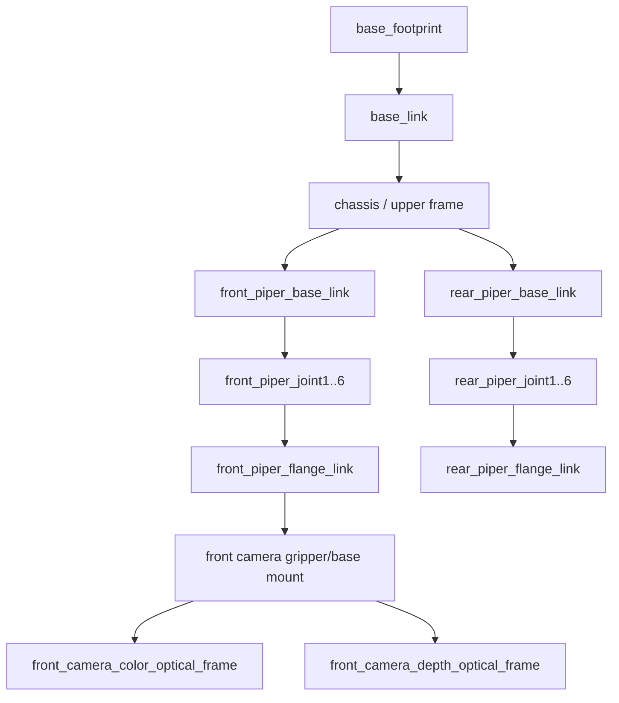

# URDF Visualization

This repo contains two robot-description paths:

- `bunker_dual_piper_nav2/urdf/bunker_dual_piper_d435i.urdf.xacro` for the editable dual-PiPER model.
- `bunker_slam_bringup/descriptions/nav_man_full_robot.urdf` for the integrated Nav-Man robot description used by the startup flow.

## Frame Sketch



## Hardware-Free Preview

Use this when you only want to inspect meshes, TF layout, and the RViz model:

```bash
cd /ros2_ws
source /opt/ros/humble/setup.bash
source install/setup.bash

ros2 launch bunker_dual_piper_nav2 system_bringup.launch.py \
  start_hardware_drivers:=false \
  start_cameras:=false \
  start_nav2:=false \
  publish_default_joint_states:=true \
  prefix_joint_states:=false \
  start_rviz:=true
```

Expected result:

- The Bunker base points along +X.
- The front PiPER is mounted at the front upper frame.
- The rear PiPER is mounted at the rear upper frame.
- Default parked joints are visible even without live `/feedback/joint_states`.
- RViz has no duplicate TF warnings for PiPER, camera, or `base_link`.

## Integrated Nav-Man Preview

When running the full Nav-Man stack, use the runbook:

```bash
less bunker_slam_bringup/NAV_MAN_INTEGRATION_STARTUP.md
```

Terminal 1 publishes the integrated `/robot_description`, `/tf`, `/tf_static`, and `/joint_states`. Front PiPER MoveIt and the wall-touch stack must consume that tree instead of starting another robot-state publisher.

## Files To Check When Updating Geometry

| File | Check |
|---|---|
| `bunker_dual_piper_nav2/urdf/bunker_dual_piper_d435i.urdf.xacro` | Mount offsets, camera origins, and PiPER orientation arguments. |
| `bunker_dual_piper_nav2/urdf/piper_arm_macro.xacro` | PiPER joint/link names and gripper links. |
| `bunker_dual_piper_nav2/rviz/urdf_camera_preview.rviz` | RViz camera/model view used for quick geometry review. |
| `bunker_slam_bringup/descriptions/nav_man_full_robot.urdf` | Generated integrated description consumed by Nav-Man startup. |

After changing xacro geometry, regenerate or rebuild the workspace and inspect TF before running physical motion.
